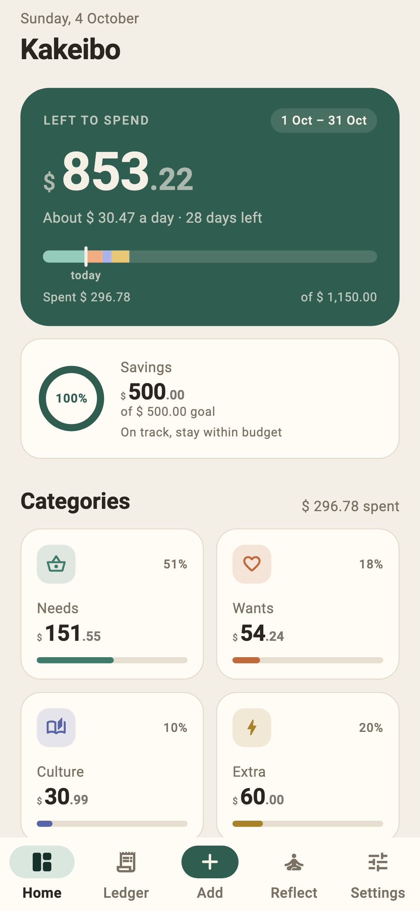
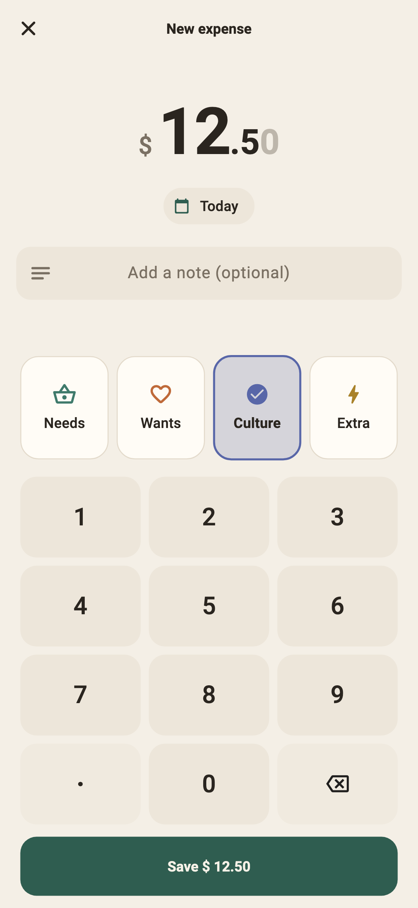
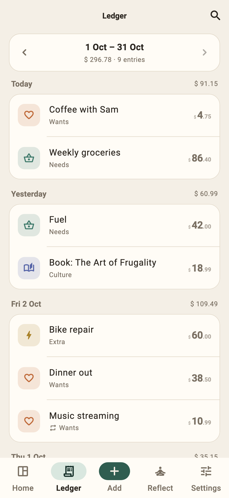
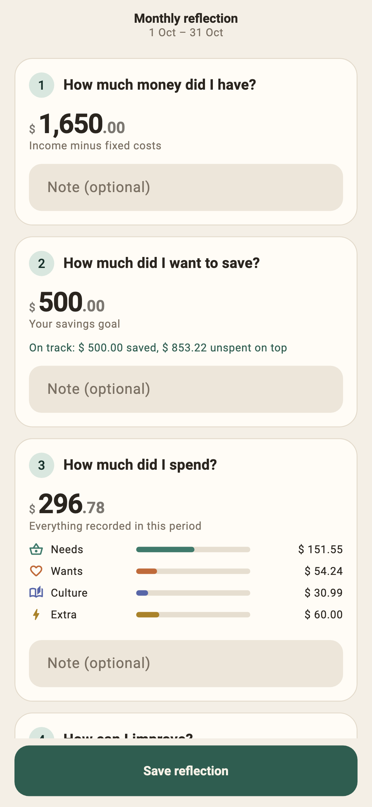

<p align="center">
  
</p>

<h1 align="center">Kakeibo</h1>

<p align="center">Mindful budgeting the Japanese way. Offline, private, no ads.</p>

<p align="center">
  
  
  
  
</p>

Kakeibo is a calm, simple budgeting app for Android based on *kakeibo* (家計簿), the
Japanese method of mindful spending: plan your month with intention, write down what
you spend, and reflect on how to improve.

## Private by design

- Works fully offline. The app does not even request the internet permission.
- No account, no ads, no analytics, no tracking.
- Your data stays on your phone. Backups are plain files that you save and keep.

## Features

- **Monthly plan:** income, fixed costs and a savings goal give you what's left to spend,
  with a daily allowance.
- **Quick entry:** type the amount, pick a category (Needs, Wants, Culture, Extra), save.
- **Home:** money left, spending per category and a savings ring. Overspending eats into
  savings first.
- **Ledger:** expenses grouped by day, month by month, with search, editing and undo.
- **Reflection:** weekly and monthly reviews built on the four kakeibo questions.
- **Recurring expenses** such as subscriptions, added automatically when due.
- **Any currency**, a custom month start (e.g. payday), light and dark themes.
- **Backup and restore** to a JSON file, and **CSV export** for spreadsheets.
- Optional **app lock** (fingerprint, face or phone PIN) and a **privacy mask** for
  amounts.

## Download

Kakeibo will be available on IzzyOnDroid and F-Droid. Until then, signed APKs are
attached to the [releases](https://github.com/tabbouleh-studio/kakeibo-android/releases).

## Building from source

Requires the Flutter stable SDK (Dart 3.12 or newer) and the Android SDK.

```sh
flutter pub get
dart run build_runner build
flutter test
flutter build apk --release --target-platform android-arm64
```

SQLite is compiled from the bundled source in `third_party/sqlite`, so the build never
downloads pre-built binaries.

**Signing:** release builds are signed when `android/key.properties` points to a
keystore (`storeFile`, `storePassword`, `keyAlias`, `keyPassword`). Without that file the
release APK is left unsigned, for you or a build service to sign.

## Contributing

Bug reports and ideas are welcome in the
[issues](https://github.com/tabbouleh-studio/kakeibo-android/issues). Kakeibo stays
small on purpose: fewer features, done well, with privacy first.

## License

Copyright © Tabbouleh Studio. Kakeibo is free software, released under the
[GNU General Public License v3.0](LICENSE). SQLite is in the public domain.

Made with ❤️ by Tabbouleh Studio 🥗
